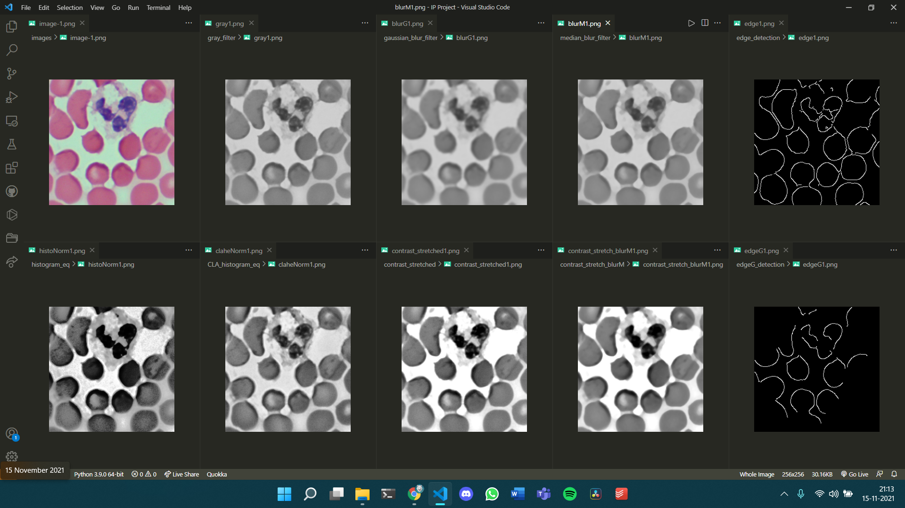

<h1 align="center"> Blood-Cell-Detection-using-Image-Processing-and-Deep-Learning </h1>

  

  
Table of Contents

  <ol>
    <li><a href="#introduction">Introduction</a></li>
    <li><a href="#project-team">Project Team</a></li>
    <li><a href="#project-objective">Project Objective</a></li>
    <li><a href="#tools-used">Tools Used</a></li>
    <li><a href="#methodology">Methodology</a></li>
    <li><a href="#implementation">Implementation</a></li>
    <li><a href="#inference">Inference</a></li>
    <li><a href="#conclusion">Conclusion</a></li>
    <li><a href="#references">References</a></li>
    <!---
    <li><a href="#contact-us">Contact Us</a></li>
    --->
  </ol>

## Introduction

## Project Team

Guidance Professor: Dr. Viswanathan P, School of Computer Science and Engineering, VIT Vellore.

The group for our Image Processing project consists of -

|S.No. | Name                | Reg. No   |
| -    | ------------------- |:---------:|
| 1    | Siddharth Pal       | 20BDS0409 |
| 2    | Vasundhara Polya    | 20BCB0016 |
| 3    | Vasu Garg           | 20BCE0451 |
| 4    | Sabarish Sundaram M | 20BCE2055 |
| 5    | Saharsh Bagrodia    | 20BCT0315 |

## Project Objective

Develop a method for blood cell detection with improvement of the image data by enhancing some image features. Clearly explain the steps taken that
are used for preprocessing an image dataset with an experimental output.

## Tools Used

To achieve the project objective we make use of the following tools -

* **Python Language Libraries**
	* Numpy
	* Pandas
	* OpenCV2
	* Glob
  * Matplotlib
  * Scikit-learn
  * Keras
  * Tensorflow

## Methodology

## Implementation

* **Blood Sample Dataset**
	In this project, the following dataset was used for the purpose of performing image processing: https://www.kaggle.com/draaslan/blood-cell-detection-dataset
	This dataset contains 100 blood sample images.

* **Image processing techniques used**
	1. Pre-processing
	2. Enhancement
	3. Segmentation
	4. Feature extraction
	5. Recognition
  

* **For Pre-processing and image enhancement we have used the following techniques and filters**

1. Converting into gray-scale image
Code used: cv.cvtColor(src, code[, dst[, dstCn]]) ->dst

		src: input image
		dst: output image of the same size and depth as src
		code: color space conversion code
		dstCn: number of channels in the destination image; 

	if the
parameter is 0, the number of the channels is derived
automatically from src and code.
--------------------------------
2. Median filter
Code used: cv.medianBlur(src, ksize[, dst]) ->dst

		src: input image
		dst: output image of the same size and type as src
		ksize: aperture linear size. It must be odd and greater than 1
--------------------------------
3. Gaussian filter
Code used: cv.GaussianBlur(src, ksize, sigmaX[, dst[, sigmaY[,
borderType]]]) ->dst

		src: input image
		dst: output image of the same size and type as src
		ksize: Gaussian kernel size
		sigmaX: kernel standard deviation in X
		sigmaY: kernel standard deviation in Y
		borderType: pixel extrapolation method
---------------------------------
4. Histogram equalization

		Code used: cv.equalizeHist(src[, dst]) ->dst
		src: input image
		dst: output image of the same size and type as src
---------------------------------
5. Clahe normalisation\
Codes used:

	● cv.createCLAHE([, clipLimit[, tileGridSize]]) ->retval

		clipLimit: threshold for the contrast limiting
		tileGridSize: Size of grid for Histogram equalization. 
		Based on size given here the input image will be divided 
		into equally sized rectangles.
	● cv.CLAHE.apply(src[, dst]) ->dst

		src: input image
		dst: output image
---------------------------------
6. Contrast stretching\
Code used: 

	class numpy.vectorize(pyfunc, otypes=None,
doc=None, excluded=None, cache=False,
signature=None)->vectorized

		pyfunc : callable function or method
		otypes: optional specification of output data type(s)
		doc : optional docstring specification
		exclusion : optional way to add a set of strings or integers
		representing the positional or keyword arguments for which the
		function will not be vectorized.
		cache: optionally cache the first function call that determines 
		the number of outputs if otypes is not provided (if true)
		signature: Optional generalized universal function signature
		for vectorized matrix-vector multiplication.
		vectorized: vectorized output function
----------------------------------
We used the contrast stretched image to perform segmentation and
feature extraction
● For the Segmentation and Feature extraction, we have used the
following techniques-:
1. Canny edge detection\
Code used: 
cv.Canny(image, threshold1, threshold2[, edges[,
apertureSize[, L2gradient]]]) ->edges

		image: 8 bit input image
		edges: output image
		threshold1: first threshold for the hysteresis procedure
		threshold2: second threshold for the hysteresis procedure
		apertureSize: for the Sobel operator
		L2gradient: flag whether to use the more accurate L2 norm, or 
		stick with L1, to calculate image gradient magnitude
------------------------------------
2. Closing
Code used:cv.morphologyEx(src, op, kernel[, dst[, anchor[,
iterations[, borderType[, borderValue]]]]]) ->dst

		src: source image
		dst: destination image of same size and type as source image
		op: type of morphological operation, cv.MORPH_CLOSE used here.
		kernel: structuring element
		anchor: anchor position with kernel
		iterations: number of times the morphological processing is
		applied.
		borderType: pixel extrapolation method
		borderValue : border value in case of a constant border
-----------------------------------------
3. Dilation
Code used: cv.dilate(src, kernel[, dst[, anchor[, iterations[,
borderType[, borderValue]]]]]) ->dst

		src: source image
		dst: destination image of same size and type as source image
		kernel: structuring element
		anchor: anchor position with kernel
		iterations: number of times the morphological processing is
		applied.
		borderType: pixel extrapolation method
		borderValue : border value in case of a constant border
-------------------------------------------
4. Adaptive Thresholding
Codes Used:
cv.adaptiveThreshold(src, maxValue, adaptiveMethod,
thresholdType, blockSize, C[, dst]) ->dst

		src: input image
		dst: output image of same size and type as src
		maxValue: Non-zero value assigned to the pixels for which the
		condition is satisfied
		adaptiveMethod: Adaptive thresholding algorithm used, in this
		project, ADAPTIVE_THRESH_MEAN_C and
		ADAPTIVE_THRESH_GAUSSIAN_C have been used
		thresholdType: Thresholding type used. In this project,
		THRESH_BINARY and THRESH_OTSU have been used
------------------------------------------
5. Hough Transform for circle detection
Code Used: cv.HoughCircles(image, method, dp, minDist[, circles[,
param1[, param2[, minRadius[, maxRadius]]]]]) ->circles

		image: grayscale image input
		circles: output vector of found circles
		method: detection method . In this project,
		cv2.HOUGH_GRADIENT has been used.
		dp: Inverse ratio of the accumulator resolution to the image
		resolution.
		minDist: Minimum distance between the centers of the detected
		circles.
		param1: First method-specific parameter.
		param2: Second method-specific parameter.
		minRadius: Minimum circle radius.
		maxRadius: Maximum circle radius.

## Inference

## Conclusion

## References

<!---
## Contact Us

--->
